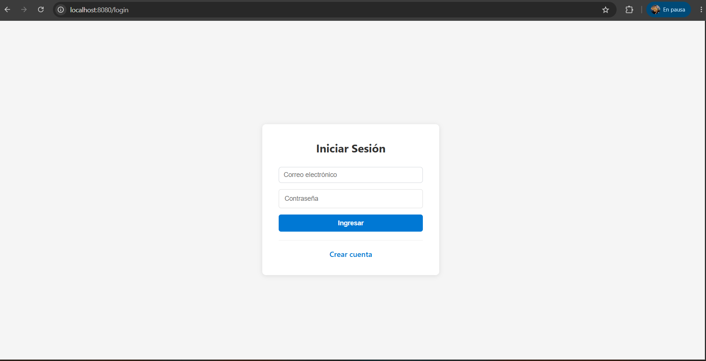
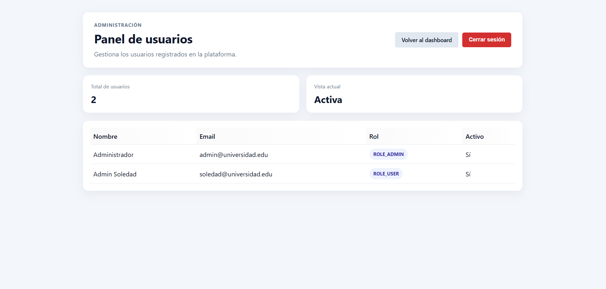
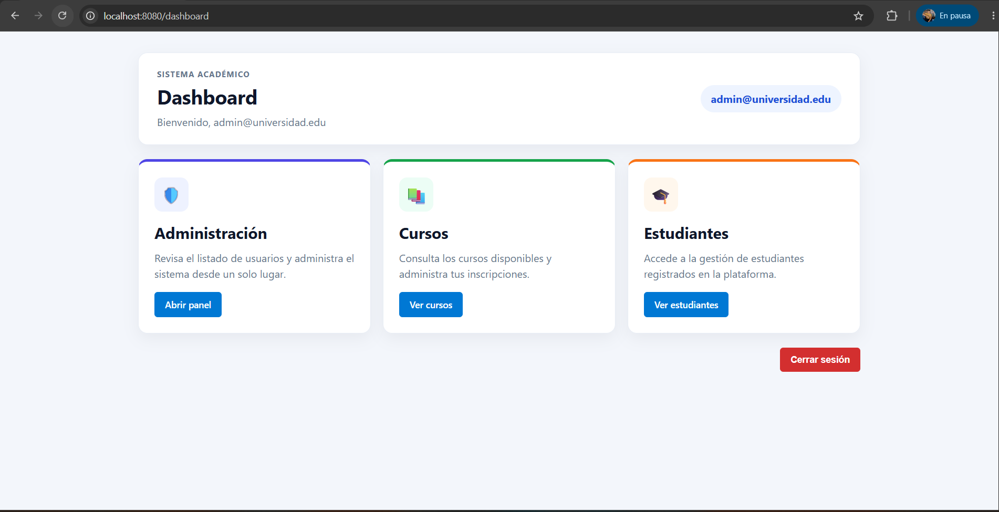
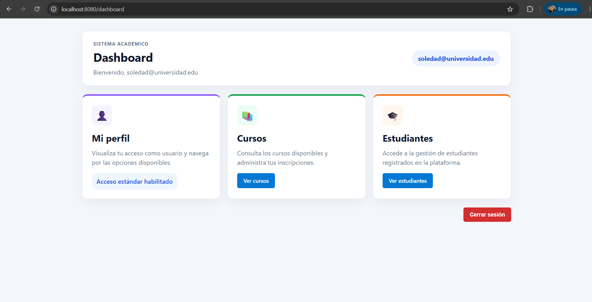
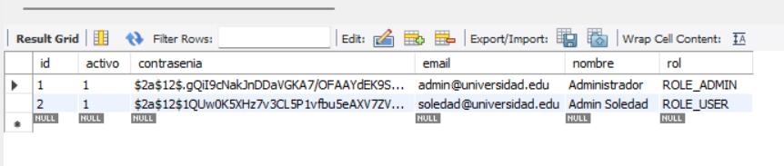

# Sistema de Seguridad - CursoReserva

Aplicacion Spring Boot con autenticacion y autorizacion por roles (`ROLE_ADMIN`, `ROLE_USER`) usando MySQL + Spring Security + Thymeleaf.

## 1) Requisitos

- Java 17
- MySQL 8+
- Maven 3.9+ (opcional si usas `mvnw`)

## 2) Configuracion de MySQL

La aplicacion esta configurada actualmente con estos valores (ver `src/main/resources/application.properties`):

- URL: `jdbc:mysql://localhost:3306/estudiantes_db?useSSL=false&serverTimezone=UTC&allowPublicKeyRetrieval=true`
- Usuario DB: `appuser`
- Password DB: `apppass`

### 2.1 Crear base de datos y usuario

Ejecuta en MySQL:

```sql
CREATE DATABASE IF NOT EXISTS estudiantes_db
  CHARACTER SET utf8mb4
  COLLATE utf8mb4_unicode_ci;

CREATE USER IF NOT EXISTS 'appuser'@'localhost' IDENTIFIED BY 'apppass';
GRANT ALL PRIVILEGES ON estudiantes_db.* TO 'appuser'@'localhost';
FLUSH PRIVILEGES;
```

## 3) Ejecutar el proyecto

Desde la raiz del proyecto:

```powershell
cd "C:\Users\SOLEDAD\Desktop\CursoReserva\seguridad"
mvn clean spring-boot:run
```

App disponible en:

- `http://localhost:8080/login`

## 4) Usuarios de prueba (email/contrasena en texto claro)

> Importante: para que el login funcione, la contrasena en BD debe quedar hasheada con BCrypt. El flujo recomendado es crear usuarios desde `/registro`.

### 4.1 Credenciales sugeridas para testing

- ADMIN:
  - Email: `admin@universidad.edu`
  - Contrasena (texto claro): `admin123`
- USER:
  - Email: `soledad@universidad.edu`
  - Contrasena (texto claro): `sebas123`

### 4.2 Pasos para cargar estos usuarios

1. Abre `http://localhost:8080/registro` y registra ambos usuarios con esas credenciales.
2. Promueve al usuario admin a rol ADMIN en MySQL:

```sql
USE estudiantes_db;

UPDATE usuarios
SET rol = 'ROLE_ADMIN', activo = 1
WHERE email = 'admin@universidad.edu';

UPDATE usuarios
SET rol = 'ROLE_USER', activo = 1
WHERE email = 'user@universidad.edu';
```

3. Verifica datos:

```sql
SELECT nombre, email, rol, activo
FROM usuarios
WHERE email IN ('admin@universidad.edu', 'user@universidad.edu');
```

## 5) Pruebas funcionales recomendadas

### 5.1 Login

- Ir a `http://localhost:8080/login`
- Ingresar con:
  - `admin@universidad.edu` / `Admin123!`
  - `user@universidad.edu` / `User123!`

### 5.2 Dashboard ADMIN

- Iniciar sesion con ADMIN
- Entrar a `/dashboard`
- Validar que aparece tarjeta/boton de Administracion y acceso a `/admin`

### 5.3 Acceso denegado para USER

- Iniciar sesion con USER
- Intentar abrir `http://localhost:8080/admin`
- Debe mostrarse mensaje/pagina de acceso denegado (403)

## 6) Capturas solicitadas

Guarda las imagenes en `docs/capturas/` con estos nombres:

- `login.png`
- `dashboard-admin.png`
- `acceso-denegado-user.png`

Y quedaran embebidas automaticamente aqui:

### Formulario de login



### Usuarios registrados con roles


### Dashboard de ADMIN



### Acceso denegado para USER



### Registro de nuevo usuario en MySQL


